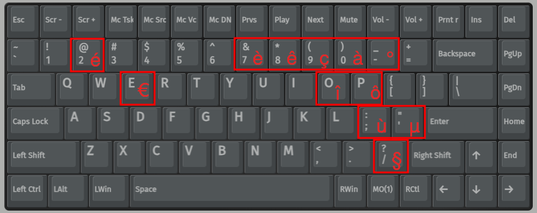

# Nuphy Air 75 v2 Qwerty layout extended for french language

I have made this repository because of my keyboard lack of latin letters diacritics.

This repository is intented to work with [Nuphy Air 75 v2](https://nuphy.com/products/air75-v2?_pos=1&_sid=5d5e70d9b&_ss=r)
but macros can work with any device supporting usevia.



> The `î` and `ô` are missplaced, I will give an update asaic.

## How to use

Just import the [layout file](./src/layout.json) in [usevia.app](https://usevia.app) or copy/paste macros inside your layout file.

## How it works

Simply macro : CTRL + Shift + U + {UNICODE_CHAR_CODE} + SPACE (won't work on ubuntu without)

``` json
    // Comments are not allowed when importing layout file    
    "{+KC_LCTL}{+KC_LSFT}u00e9{KC_SPC}{-KC_LSFT}{-KC_LCTL}", // u00e9 é (acute e)
    "{+KC_LCTL}{+KC_LSFT}u00e8{KC_SPC}{-KC_LSFT}{-KC_LCTL}", // u00e8 è (grave e)
    "{+KC_LCTL}{+KC_LSFT}u00ea{KC_SPC}{-KC_LSFT}{-KC_LCTL}", // u00ea ê (circumflex e)
    "{+KC_LCTL}{+KC_LSFT}u00e0{KC_SPC}{-KC_LSFT}{-KC_LCTL}", // u00e0 à (grave a)
    "{+KC_LCTL}{+KC_LSFT}u00f9{KC_SPC}{-KC_LSFT}{-KC_LCTL}", // u00f9 ù (grave u)
    "{+KC_LCTL}{+KC_LSFT}u20ac{KC_SPC}{-KC_LSFT}{-KC_LCTL}", // u20ac € (euro sign)
    "{+KC_LCTL}{+KC_LSFT}u00e7{KC_SPC}{-KC_LSFT}{-KC_LCTL}", // u00e7 ç (cedilla c)
    "{+KC_LCTL}{+KC_LSFT}u00f4{KC_SPC}{-KC_LSFT}{-KC_LCTL}", // u00f4 ô (circumflex o)
    "{+KC_LCTL}{+KC_LSFT}u00ee{KC_SPC}{-KC_LSFT}{-KC_LCTL}", // u00ee î (circumflex i)
    "{+KC_LCTL}{+KC_LSFT}u00b5{KC_SPC}{-KC_LSFT}{-KC_LCTL}", // u00b5 µ (micro sign)
    "{+KC_LCTL}{+KC_LSFT}u00a7{KC_SPC}{-KC_LSFT}{-KC_LCTL}", // u00a7 § (section sign)
    "{+KC_LCTL}{+KC_LSFT}u00b0{KC_SPC}{-KC_LSFT}{-KC_LCTL}", // u00b0 ° (degree sign)
    "{+KC_LCTL}{+KC_LSFT}u005e{KC_SPC}{-KC_LSFT}{-KC_LCTL}"  // u005e ^ (caret)
``` 

## Get device info

``` bash
lsusb -vd 19f5: > device_info.log
```

> See : https://linux-hardware.org/?id=usb:19f5-3245

## Setup UseVia support (optional)

``` bash
sudo cp ./src/99-custom-hidraw.rules /etc/udev/rules.d/
sudo udevadm control --reload-rules
```

### UseVia troubleshoot

#### Checkout this page

[chrome://device-log](chrome://device-log)

#### You may try to change device permissions

``` bash
chmod a+rw /dev/hidrawX # change the X value
```
